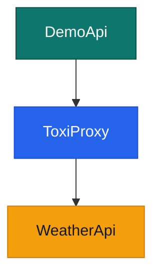

# Aspire.Hosting.ToxiProxy

Aspire.Hosting.ToxiProxy is a .NET Aspire component that integrates [ToxiProxy](https://github.com/Shopify/toxiproxy) into your distributed application, allowing you to simulate network conditions and faults for testing purposes.

🚨Looking for feedback! 🚨
Before I spend time on further completing the functionality I prefer wom feedback. Just submit an issue. But before you do, please read this document to the end please.

### Nuget: [Nwwz.Aspire.Hosting.ToxiProxy](https://www.nuget.org/packages/Nwwz.Aspire.Hosting.ToxiProxy/)

## Available methods

### `AddToxiProxyServer`
Adds a ToxiProxy server container resource to the Aspire application model.

- **Parameters**:
  - `name`: The name of the ToxiProxy resource.
  - `port`: (Optional) The host port for the ToxiProxy server. Defaults to 8474 if not specified.
- **Example**:
  ```csharp
  var proxyServer = builder.AddToxiProxyServer("toxiproxy");
  ```

### `AddLatency`
Adds a "latency toxic"

- **Parameters**:
  - `name`: The name of the toxic.
  - `latency`: latency in ms.
  - `jitter`: jitter in ms.
  - `toxicity`: probability of the toxic being applied to a link (defaults to 1.0, 100%).
  - `direction`: link direction to affect (defaults to downstream).
- **Example**:
  ```csharp
  proxy.AddHttpProxy("apiProxy", 8666, 5103, "weatherapi")
       .AddLatency("latency", 123, 0, 0.45, Direction.Upstream);
  ```
  
### `AddBandwidthLimit`
Adds a "bandwidth toxic"

- **Parameters**:
  - `name`: The name of the toxic.
  - `lbandwidth`: Bandwidth limit in in KB/s.
  - `toxicity`: probability of the toxic being applied to a link (defaults to 1.0, 100%).
  - `direction`: link direction to affect (defaults to downstream).
- **Example**:
  ```csharp
  proxy.AddHttpProxy("apiProxy", 8666, 5103, "weatherapi")
       .AddBandwidthLimit("bandwidth", 142, 0.25, Direction.Upstream);
  ```

### `WithUi`
Adds a web-based UI for managing the ToxiProxy server. It uses the `buckle/toxiproxy-frontend` container image and automatically connects it to the ToxiProxy server resource.

- **Usage**: Can be chained onto a ToxiProxy resource builder.

> *NOTE*
>
> `WithUi` currently uses the `buckle/toxiproxy-frontend` container image. A more lightweight UI is under development (vibecode alert) and can be found in the `/toxi-ui` directory. You can add it to your `AppHost` using `WithNewUi()`.

- **Example**:
  ```csharp
  builder.AddToxiProxyServer("toxiproxy")
      .WithUi()
      .WithNewUi();
  ```
## Usage Example

Here's how you can use these methods in your `AppHost` project:

```csharp
var builder = DistributedApplication.CreateBuilder(args);

// An arbitrary
var weatherapi =  builder.AddProject<Projects.WeatherApi>("weatherapi");

// Add the ToxiProxy server and enable the UI
var proxy = builder.AddToxiProxyServer("toxiproxy")
                   .WithNewUi();

// add a proxy for the weatherapi 
var httpEndpoint = proxy.AddHttpProxy("apiProxy", 8666, weatherapi)
// and add a 1000ms latency toxic with 200ms jitter and a 45% chance
                        .AddLatency("latency", 1000, 200, 0.45, Direction.Upstream);

// Use the proxied endpoint in another service
builder.AddProject<Projects.DemoApi>("demoapi")
    .WithReference(httpEndpoint);

builder.Build().Run();
```

## Todo

- Add `AddConnectionStringProxy` to support toxi proxy sitting in between an DB and an app
- Get rid of the need to specify a port. `proxy.AddHttpProxy("apiProxy", weatherapi)` should be sufficient instead of `proxy.AddHttpProxy("apiProxy", 8666, weatherapi)`
- Add support to create a Toxic for an external service.
- Add support for all toxic types
  - slow_close
  - timeout
  - reset_peer
  - slicer
  - limit_data

## Ideas
- Basic control (like pausing) over the Toxies and Proxies via Aspire UI
- More advanced control via a dedicated UI

## Testing

The `test` folder of this repository contains a Aspire AppHost project with a WeatherApi a DemoApi and the ToxiProxy in between them:


There are tests, that both make use of the aspire apphost:
1. A test to confirm if services are wired up correctly.
1. An approval test on the configuration that is loaded into the ToxiProxy instance.

## License

See `LICENSE` file