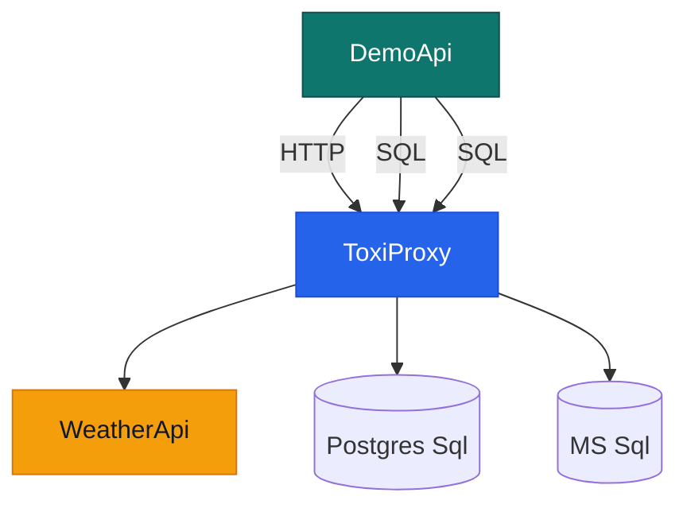

# Aspire.Hosting.ToxiProxy

Aspire.Hosting.ToxiProxy is a .NET Aspire component that integrates [ToxiProxy](https://github.com/Shopify/toxiproxy) into your distributed application, allowing you to simulate network conditions and faults for testing purposes.

🚨Request for feedback! 🚨
Before I spend time on further completing the functionality I prefer some feedback. Just submit an issue, reach out on the socials, send a pigeon, whatever. And before you do, please read this document to the end?

### Nuget
`dotnet add package Nwwz.Aspire.Hosting.ToxiProxy --version 0.0.1-alpha002`

[Nwwz.Aspire.Hosting.ToxiProxy](https://www.nuget.org/packages/Nwwz.Aspire.Hosting.ToxiProxy/)

## Usage Example

There are two ways to add ToxiProxy to your AppHost.
One is the low impact API, and a straightforward version that actually represents the technology a bit better.
At the time of writing I have not yet decided to keep them both or which one to keep. Any thoughts or feedback is welcome!

You might already have `AppHost`:

```csharp
var builder = DistributedApplication.CreateBuilder(args);

// Database server and database
var pgsql = builder.AddPostgres("postgres")
    .AddDatabase("postgresdb");

// An api that uses the database
builder.AddProject<Projects.DemoApi>("demoapi")
    .WithReference(pgsql);

builder.Build().Run();
```
### Low impact API

```csharp
var builder = DistributedApplication.CreateBuilder(args);

// Add toxicity and a specified latency
var pgsql = builder.AddPostgres("postgres")
    .AddDatabase("postgresdb")
        .WithToxicity("pgsqlProxy", 8669)
        .AddLatency("latency", 123, 0, 0.75, Direction.Upstream);

// Add the ToxiProxy server and attach the database proxy
var proxy = builder.AddToxiProxyServer("toxiproxy")
                   .With(pgsql);

// This remains unchanged
builder.AddProject<Projects.DemoApi>("demoapi")
    .WithReference(pgsql);

builder.Build().Run();
```

### Straight forward API

```csharp
var builder = DistributedApplication.CreateBuilder(args);

// Add toxicity and a specified latency
var pgsql = builder.AddPostgres("postgres")
    .AddDatabase("postgresdb");

// Add the ToxiProxy server
var proxy = builder.AddToxiProxyServer("toxiproxy");

// Add a toxic connection string based that links to the created database
var toxicPgSql = proxy.AddConnectionStringProxy("pgsqlProxy", 8669, pgsql)
    .AddLatency("latency", 123, 0, 0.75, Direction.Upstream);

// Use the new connection string
builder.AddProject<Projects.DemoApi>("demoapi")
    .WithReference(toxicPgSql);

builder.Build().Run();


```

## Available methods

### `WithToxicity`
Builds a `ToxicConnectionStringResource` or `ToxicEndpointResource`. Use this with the "low impact API"

- **Parameters**:
  - `name`: The name of the toxic.
  - `port`: Port to be used by the new Connection String or Endpoint.
- **Example**:
  ```csharp
  var pgsql = builder.AddPostgres("postgres")
    .AddDatabase("postgresdb")
        .WithToxicity("pgsqlProxy", 8669)
  ```

### `AddHttpProxy`
Builds a `ToxicEndpointResource`. Use this with the "straightforward API"

- **Parameters**:
  - `name`: The name of the toxic.
  - `port`: Port to be used by the new Endpoint.
  - `proxiedService`: Any resource builder that builds an endpoint resource.
- **Example**:
  ```csharp
  var toxicApi = proxy.AddHttpProxy("apiProxy", 8666, weatherapi)
  ```

### `AddConnectionStringProxy`
Builds a `ToxicConnectionStringResource`. Use this with the "straightforward API"

- **Parameters**:
  - `name`: The name of the toxic.
  - `port`: Port to be used by the new Connection String.
  - `proxiedService`: Any resource builder that builds an endpoint resource.
- **Example**:
  ```csharp
  var toxicPgsql = proxy.AddConnectionStringProxy("apiProxy", 8666, pgsql)
  ```

### `AddLatency`
Adds a "latency toxic" to a `ToxicConnectionStringResource` or `ToxicEndpointResource`

- **Parameters**:
  - `name`: The name of the toxic.
  - `latency`: latency in ms.
  - `jitter`: jitter in ms.
  - `toxicity`: probability of the toxic being applied to a link (defaults to 1.0, 100%).
  - `direction`: link direction to affect (defaults to downstream).
- **Example**:
  ```csharp
  .AddLatency("latency", 123, 0, 0.45, Direction.Upstream);
  ```
  
### `AddBandwidthLimit`
Adds a "bandwidth toxic" to a `ToxicConnectionStringResource` or `ToxicEndpointResource`

- **Parameters**:
  - `name`: The name of the toxic.
  - `bandwidth`: Bandwidth limit in KB/s.
  - `toxicity`: probability of the toxic being applied to a link (defaults to 1.0, 100%).
  - `direction`: link direction to affect (defaults to downstream).
- **Example**:
  ```csharp
  .AddBandwidthLimit("bandwidth", 142, 0.25, Direction.Upstream);
  ```

### `AddToxiProxyServer`
Adds a ToxiProxy server container resource to the Aspire application model.

- **Parameters**:
  - `name`: The name of the ToxiProxy resource.
  - `port`: (Optional) The host port for the ToxiProxy server. Defaults to 8474 if not specified.
- **Example**:
  ```csharp
  var proxyServer = builder.AddToxiProxyServer("toxiproxy");
  ```

### `WithUi`
Adds a web-based UI to the `ToxiProxyServer` for managing the ToxiProxy server. It uses the `buckle/toxiproxy-frontend` container image and automatically connects it to the ToxiProxy server resource.

- **Usage**: Can be chained onto a ToxiProxy resource builder.

> *NOTE*
>
> `WithUi` currently uses the `buckle/toxiproxy-frontend` container image. A more lightweight UI is under development (vibecode alert) and can be found in the `/toxi-ui` directory. You can add it to your `AppHost` using `WithNewUi()`.

### `With`
Attach a `ToxicConnectionStringResource` or `ToxicEndpointResource` to the `ToxiProxyServer` for managing the ToxiProxy server. Use this with the "low impact API"
- **Usage**: Can be chained onto a ToxiProxy resource builder.
- **Example**:
  ```csharp
  var proxyServer = builder.AddToxiProxyServer("toxiproxy")
                            .With(existingResource);
  ```

## Status
- [x] Endpoint support for Toxi proxy in front of an endpoint resource
  - Tested with:
    - ✅ http
    - ❌ https
- [x] ConnectionString support for Toxi proxy in front of a DB
  - Tested with:
    - ✅ MS SQL
    - ✅ Postgres SQL
    - ❓ Redis
    - ❓ MySql
    - ❓ MariaDB
- [ ] Get rid of the need to specify a port. `proxy.AddHttpProxy("apiProxy", weatherapi)` should be sufficient instead of `proxy.AddHttpProxy("apiProxy", 8666, weatherapi)`
- [ ] Support to create a toxic for an arbitrary service.
- [ ] Supported toxic types
  - [x] latency
  - [x] bandwidth
  - [ ] slow_close
  - [ ] timeout
  - [ ] reset_peer
  - [ ] slicer
  - [ ] limit_data
- [ ] HealthChecks
- [ ] WaitFor()

## Ideas
- Basic control (like pausing) over the Toxies and Proxies via Aspire UI
- More advanced control via a dedicated UI
- ....
- ....
- Your feedback here!

## Testing

The `test` folder of this repository contains an Aspire AppHost project with a WeatherApi, 2 databases, a DemoApi and ToxiProxy in between them:


There are two tests, that both make use of the aspire `AppHost`:
1. A test to confirm if services are wired up correctly.
1. An approval test on the configuration that is loaded into the ToxiProxy instance.

## License

See `LICENSE` file